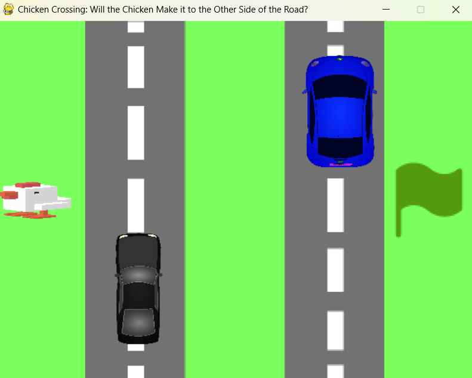

# Mariah's Team
## CS110 Final Project  Fall, 2024

## Team Members

Mariah Brand

## Project Description

A game similar to crossy road where the the goal is to get the chicken across the road without it being hit by cars. 

## GUI Design

### Initial Design

### Final Design

## Program Design

- chicken and car figures
- moveable characters
- moveable cars
- game over screen 
- obstacle collisions

### Features

1. pygame
2. collision detection
3. you lose game screen
4. you win game screen
5. movable car and player objects

### Classes

Player() : Creates player object as well as initalizing movement and collision with cars resulting in 'you lose' screen. 
Screen() : Creates screen and stops player movement when collided with end of the screen
Car() : Creats 2 car objects as well as initializing automatic movement 
Flag() : Flag object created to act as collision that results in 'you win' screen

- << You should have a list of each of your classes with a description >>

## ATP

| Step |Procedure                                        |Expected Results                           |
|------|:----------------------------------------------:|-------------------------------------------:|
|  1   | Run  Program                                   |GUI window appears with main game screen    |
|  2   | use keyboard arrows to move chicken            | chicken will move which ever way the arrows|     
|  3   | if collide with cars                           |  you lose screen will pop in and out       | 
|  4   | make it too other side and touch flag          | you win screen pops up                     |
|  5   | exit out of pygame once you reach either screen| you win screen pops up                     |
 